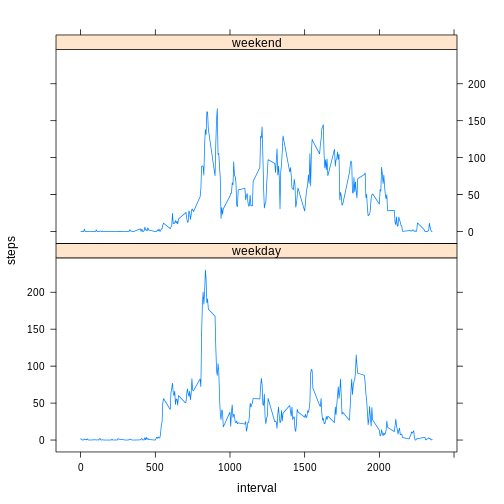

# Reproducible Research: Peer Assessment 1

Setting global defaults.


```r
library(lattice)

opts_chunk$set(echo=TRUE)
```

## Loading and preprocessing the data


```r
unzip('activity.zip')
activity <- read.csv('activity.csv', colClasses=c('integer','Date','integer'))
```

## What is mean total number of steps taken per day?

In order to plot the histogram, the numbers of steps per day are aggregated with the following expressions.


```r
sum_activity <- aggregate(activity$steps, by=list(activity$date), FUN=sum)
names(sum_activity) <- c('date','steps')
```

The plot is given below.


```r
with(sum_activity, hist(steps, 10))
```

 


The mean total number of steps taken per day is computed by the following formula:


```r
mean(sum_activity$steps, na.rm=T)
```

```
## [1] 10766
```

The median of steps taken per day is given by the following expression:


```r
median(sum_activity$steps, na.rm=T)
```

```
## [1] 10765
```


## What is the average daily activity pattern?

Average per interval number of steps is calculated by the following expressions.


```r
avg_daily_activity <- aggregate(activity$steps, by=list(activity$interval), FUN=mean, na.rm=T)
names(avg_daily_activity) <- c('interval','steps')
```

The plot is given below.

```r
with(avg_daily_activity, plot(interval, steps, type = 'l'))
```

 

The maximum number of steps across all days is achieved within the interval computed by the formula below.


```r
max_steps <- max(avg_daily_activity$steps)
avg_daily_activity[avg_daily_activity$steps == max_steps, ]$interval
```

```
## [1] 835
```

## Imputing missing values

The total number of missing values in the dataset:


```r
sum(is.na(activity$steps))
```

```
## [1] 2304
```

The missing values in the new dataset will be filled by per interval mean values:


```r
mvactivity <- activity

for (i in 1:nrow(mvactivity)) {
  if (is.na(mvactivity[i, ]$steps)) {
    mvint <- mvactivity[i, ]$interval
    mvactivity[i,]$steps <- avg_daily_activity[avg_daily_activity$interval == mvint, ]$steps
  }
}
```

The histogram of the new dataset is given below.


```r
mvsum_activity <- aggregate(mvactivity$steps, by=list(mvactivity$date), FUN=sum)
names(mvsum_activity) <- c('date','steps')
with(mvsum_activity, hist(steps, 10))
```

 

The mean and median of the total number of step values for the new dataset are as follows.


```r
mean(mvsum_activity$steps, na.rm=T)
```

```
## [1] 10766
```

```r
median(mvsum_activity$steps, na.rm=T)
```

```
## [1] 10766
```

## Are there differences in activity patterns between weekdays and weekends?
Adding a new factor variable to the dataset.


```r
week_fac <- factor(sub("Monday|Tuesday|Wednesday|Thursday|Friday", "weekday", 
                sub("Sunday|Saturday", "weekend" , weekdays(mvactivity$date))))
mvactivity <- cbind(mvactivity,week_fac)
```

Making a plot.


```r
avg_wday_interval_activity <- aggregate(mvactivity$steps, by=list(mvactivity$interval, mvactivity$week_fac), FUN=mean)
names(avg_wday_interval_activity) <- c("interval", "wday", "steps")
xyplot(steps ~ interval|wday, data=avg_wday_interval_activity, type="l", layout=c(1,2))
```

 
